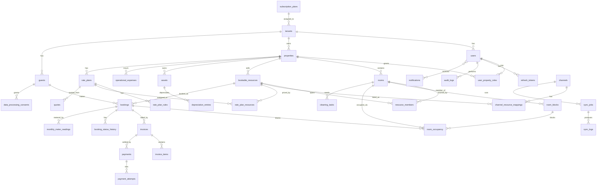

# 03 — DATABASE ERD CHI TIẾT

> **Phiên bản 3.0 (2026-06-10):** hợp nhất toàn bộ kết quả review + audit vào một schema duy nhất, không còn phần "cập nhật đè". Khi đọc file này, **mọi định nghĩa là chung cuộc**. Quyết định nền: [ADR-0001](adr/0001-orm-strategy.md) (SQL-first), [ADR-0002](adr/0002-rls-tenant-context-and-pooling.md) (RLS context), [ADR-0003](adr/0003-financial-ledger.md) (tài chính), [ADR-0005](adr/0005-tenant-isolation-composite-fk.md) (composite FK), [ADR-0006](adr/0006-bookable-unit-model.md) (bookable unit), [ADR-0007](adr/0007-pii-field-encryption.md) (PII).

## 1. Quy ước bắt buộc

### 1.1. Naming & kiểu dữ liệu

- **Bảng:** `snake_case`, số nhiều (`bookings`, `invoice_items`).
- **Cột:** `snake_case`. **PK:** `id UUID DEFAULT gen_random_uuid()` (hàm native PG13+, **không** cần extension `uuid-ossp`).
- **FK:** `{entity}_id`. **Timestamp:** mọi bảng có `created_at`/`updated_at TIMESTAMPTZ NOT NULL DEFAULT now()` + trigger tự bump `updated_at`. Không bao giờ dùng `TIMESTAMP` thiếu TZ.
- **Tiền:** `BIGINT` đơn vị VND (không cents, không DECIMAL/FLOAT).
- **Enum:** PostgreSQL native ENUM cho loại **ổn định** (`booking_status`, `invoice_status`); `VARCHAR + CHECK` hoặc bảng lookup cho loại **hay đổi** (`payment_method`, `booking_source`, `expense_type`) — vì `ALTER TYPE ... ADD VALUE` khó tiến hoá, không xoá/đổi được value.

### 1.2. Bốn quy tắc áp cho MỌI bảng tenant-scoped

1. **Cột `tenant_id UUID NOT NULL`** + index có `tenant_id` đứng đầu.
2. **RLS policy** (bật `ENABLE` + `FORCE`), template duy nhất:
   ```sql
   CREATE POLICY tenant_isolation ON <table>
     USING (tenant_id = NULLIF(current_setting('app.current_tenant_id', true), '')::uuid);
   CREATE POLICY tenant_isolation_insert ON <table> FOR INSERT
     WITH CHECK (tenant_id = NULLIF(current_setting('app.current_tenant_id', true), '')::uuid);
   ```
   (`NULLIF` chống lỗi `''::uuid` 22P02 khi GUC chưa set — xem ADR-0002.) Viết migration helper `enforce_tenant_isolation(table_name)` để apply uniform.
3. **Composite FK** ([ADR-0005](adr/0005-tenant-isolation-composite-fk.md)): mọi FK tenant-scoped là `(tenant_id, fk_id) REFERENCES parent(tenant_id, id)`; parent có `UNIQUE (tenant_id, id)`. Lý do: referential-integrity **bypass RLS** — FK đơn cho phép tham chiếu chéo tenant (đã kiểm chứng PG16).
4. **Soft delete:** `deleted_at TIMESTAMPTZ NULL`; mọi unique trên bảng có soft-delete là **partial unique index** `... WHERE deleted_at IS NULL` (unique thường sẽ chặn tái tạo sau khi xoá mềm). Filter mặc định `deleted_at IS NULL` qua **Prisma Client Extension** (không dùng `$use` middleware — đã deprecated).

### 1.3. Optimistic locking

Bảng hay sửa đồng thời — `bookings`, `invoices`, `rooms`, `cleaning_tasks` — có `version INT NOT NULL DEFAULT 0`, bump mỗi UPDATE; API dùng `If-Match` (xem `05-api-conventions.md` §4.5).

### 1.4. Sinh số chứng từ

`booking_code` (`BK-202606-0001`) và `invoice_number` (`INV-202606-0001`) sinh từ bảng **`document_counters`** (§4.5) bằng `SELECT ... FOR UPDATE` — atomic, không gap, reset theo tháng/tenant. Không dùng sequence-per-tenant.

## 2. Danh sách ENUM

```sql
-- Admin nền tảng KHÔNG nằm trong enum này (bảng riêng platform_users, §4.1)
CREATE TYPE user_role AS ENUM ('OWNER', 'MANAGER', 'STAFF', 'HOUSEKEEPER', 'ACCOUNTANT');
CREATE TYPE property_type AS ENUM ('HOMESTAY', 'RENT_TO_RENT', 'APARTMENT', 'HOTEL');

-- Trạng thái BUỒNG PHÒNG (housekeeping). Trạng thái "đang có khách / trống / bị block"
-- KHÔNG lưu ở đây — luôn derive từ room_occupancy/room_blocks để không drift.
CREATE TYPE housekeeping_status AS ENUM ('CLEAN', 'DIRTY', 'CLEANING', 'INSPECTION');

CREATE TYPE bookable_resource_type AS ENUM ('ROOM', 'WHOLE');
CREATE TYPE booking_mode AS ENUM ('HOURLY', 'DAILY', 'MONTHLY');
CREATE TYPE booking_status AS ENUM ('HOLD', 'PENDING', 'CONFIRMED', 'CHECKED_IN', 'CHECKED_OUT', 'CANCELLED', 'NO_SHOW');
CREATE TYPE invoice_status AS ENUM ('DRAFT', 'ISSUED', 'PARTIALLY_PAID', 'PAID', 'OVERDUE', 'VOID', 'REFUNDED');
CREATE TYPE invoice_kind AS ENUM ('DEPOSIT', 'STAY', 'MONTHLY_RENT', 'ADJUSTMENT');
CREATE TYPE payment_status AS ENUM ('PENDING', 'SUCCEEDED', 'FAILED', 'REFUNDED', 'PARTIALLY_REFUNDED');
CREATE TYPE cleaning_task_status AS ENUM ('PENDING', 'IN_PROGRESS', 'COMPLETED', 'VERIFIED', 'CANCELLED');
CREATE TYPE sync_job_status AS ENUM ('QUEUED', 'RUNNING', 'SUCCESS', 'FAILED', 'PARTIAL');
CREATE TYPE audit_action AS ENUM ('CREATE', 'UPDATE', 'DELETE', 'STATE_CHANGE', 'LOGIN', 'LOGOUT', 'EXPORT', 'READ_PII');
```

`booking_source`, `payment_method`, `expense_type` dùng `VARCHAR(32) + CHECK` (hay phải thêm giá trị):

```sql
-- booking_source: DIRECT, WALK_IN, AIRBNB_ICAL, BOOKING_ICAL, AGODA_ICAL, CHANNEX_API, OTHER
-- payment_method: CASH, VIETQR, BANK_TRANSFER, MOMO, ZALOPAY, CARD, OTA_COLLECTED, OTHER
-- expense_type:   RENT_LANDLORD, ELECTRICITY, WATER, INTERNET, GAS, AMENITIES, CLEANING_SUPPLIES,
--                 STAFF_SALARY, MAINTENANCE, MARKETING, OTA_COMMISSION, PLATFORM_FEE, TAX, OTHER
```

## 3. ERD tổng quan (Mermaid)



> Lưu ý đọc ERD: `bookings` **không còn** cột `room_id` — quan hệ booking↔phòng vật lý đi qua `room_occupancy` (ADR-0006). `bookings ||--o{ invoices` là **1:N** (DEPOSIT + STAY + MONTHLY_RENT...).

## 4. Chi tiết từng nhóm bảng

### 4.1. Global (KHÔNG có tenant_id, KHÔNG bị tenant-RLS)

#### `tenants`, `subscription_plans`
Xem `02-multi-tenancy.md` §3 (định nghĩa gốc nằm ở đó, không lặp lại).

#### `platform_users` — admin nền tảng, tách hẳn khỏi `users`
```sql
CREATE TABLE platform_users (
  id UUID PRIMARY KEY DEFAULT gen_random_uuid(),
  email CITEXT NOT NULL,
  password_hash VARCHAR(255) NOT NULL,           -- argon2id
  full_name VARCHAR(255) NOT NULL,
  is_active BOOLEAN NOT NULL DEFAULT true,
  two_factor_secret TEXT,                        -- mã hoá AES-256-GCM (ADR-0007)
  two_factor_enabled BOOLEAN NOT NULL DEFAULT false,  -- bật bắt buộc trong flow onboarding admin
  last_login_at TIMESTAMPTZ,
  created_at TIMESTAMPTZ NOT NULL DEFAULT now()
);
CREATE UNIQUE INDEX uq_platform_users_email ON platform_users (email);
```
> Auth riêng, 2FA bắt buộc (enforce ở application: chưa bật 2FA thì chỉ vào được flow enrollment). Không thuộc tenant nào, không dùng chung guard với user tenant.

#### `vietnam_holidays` — lịch lễ/nghỉ bù, NGUỒN DUY NHẤT cho pricing
```sql
CREATE TABLE vietnam_holidays (
  holiday_date DATE PRIMARY KEY,
  name VARCHAR(255) NOT NULL,
  is_substitute BOOLEAN NOT NULL DEFAULT false,  -- ngày nghỉ bù do Chính phủ công bố
  source VARCHAR(64),                            -- văn bản công bố
  created_at TIMESTAMPTZ NOT NULL DEFAULT now()
);
```
> Tết + nghỉ bù công bố **hằng năm** — KHÔNG hardcode trong `packages/pricing-engine`. Seed khi deploy + job nhắc cập nhật yearly. Pricing engine nhận danh sách holiday qua **input** (giữ pure-function).

### 4.2. Identity & Access (IAM)

#### `users`
```sql
CREATE TABLE users (
  id UUID PRIMARY KEY DEFAULT gen_random_uuid(),
  tenant_id UUID NOT NULL REFERENCES tenants(id),
  email CITEXT NOT NULL,
  phone VARCHAR(20),
  password_hash VARCHAR(255) NOT NULL,           -- argon2id
  full_name VARCHAR(255) NOT NULL,
  avatar_url TEXT,
  default_role user_role NOT NULL,
  is_active BOOLEAN NOT NULL DEFAULT true,
  email_verified_at TIMESTAMPTZ,
  phone_verified_at TIMESTAMPTZ,
  last_login_at TIMESTAMPTZ,
  failed_login_count INT NOT NULL DEFAULT 0,
  locked_until TIMESTAMPTZ,
  two_factor_secret TEXT,                        -- mã hoá AES-256-GCM (ADR-0007)
  two_factor_enabled BOOLEAN NOT NULL DEFAULT false,
  created_at TIMESTAMPTZ NOT NULL DEFAULT now(),
  updated_at TIMESTAMPTZ NOT NULL DEFAULT now(),
  deleted_at TIMESTAMPTZ,
  UNIQUE (tenant_id, id)                         -- anchor cho composite FK
);
-- partial unique: cho phép tái tạo email sau soft-delete
CREATE UNIQUE INDEX uq_users_tenant_email_live ON users (tenant_id, email) WHERE deleted_at IS NULL;
```

#### `user_property_roles` — RBAC scoped theo property
```sql
CREATE TABLE user_property_roles (
  id UUID PRIMARY KEY DEFAULT gen_random_uuid(),
  tenant_id UUID NOT NULL REFERENCES tenants(id),
  user_id UUID NOT NULL,
  property_id UUID NOT NULL,
  role user_role NOT NULL,
  permissions JSONB NOT NULL DEFAULT '{}'::jsonb,   -- {"grant": [...], "deny": [...]}
  granted_by UUID,
  granted_at TIMESTAMPTZ NOT NULL DEFAULT now(),
  UNIQUE (user_id, property_id, role),
  FOREIGN KEY (tenant_id, user_id) REFERENCES users (tenant_id, id),
  FOREIGN KEY (tenant_id, property_id) REFERENCES properties (tenant_id, id)
);
```
> OWNER có role implicit cho mọi property của tenant. Đổi role/permission phải bump `permission_version` của user trong Redis (xem `04` §4.6) để vô hiệu cache.

#### `refresh_tokens`
```sql
CREATE TABLE refresh_tokens (
  id UUID PRIMARY KEY DEFAULT gen_random_uuid(),
  tenant_id UUID NOT NULL REFERENCES tenants(id),
  user_id UUID NOT NULL,
  token_hash VARCHAR(255) NOT NULL,              -- SHA256, không lưu plain
  device_fingerprint VARCHAR(255),
  ip_address INET,
  user_agent TEXT,
  expires_at TIMESTAMPTZ NOT NULL,
  revoked_at TIMESTAMPTZ,
  rotated_to UUID REFERENCES refresh_tokens(id), -- chain để detect reuse + grace window (04 §2)
  created_at TIMESTAMPTZ NOT NULL DEFAULT now(),
  FOREIGN KEY (tenant_id, user_id) REFERENCES users (tenant_id, id)
);
CREATE INDEX idx_refresh_tokens_lookup ON refresh_tokens(token_hash) WHERE revoked_at IS NULL;
```

### 4.3. Property, Room & Bookable Unit

#### `properties`
```sql
CREATE TABLE properties (
  id UUID PRIMARY KEY DEFAULT gen_random_uuid(),
  tenant_id UUID NOT NULL REFERENCES tenants(id),
  name VARCHAR(255) NOT NULL,
  property_type property_type NOT NULL,
  address_line VARCHAR(500) NOT NULL,
  ward VARCHAR(100),
  district VARCHAR(100),
  province VARCHAR(100) NOT NULL,                -- bắt buộc để báo cáo công an
  latitude DECIMAL(10, 7),
  longitude DECIMAL(10, 7),
  timezone VARCHAR(64) NOT NULL DEFAULT 'Asia/Ho_Chi_Minh',  -- pricing tính ngày theo TZ này

  -- Rent-to-Rent
  is_rent_to_rent BOOLEAN NOT NULL DEFAULT false,
  landlord_name VARCHAR(255),
  landlord_phone VARCHAR(20),
  rent_to_rent_contract_start DATE,
  rent_to_rent_contract_end DATE,
  monthly_landlord_rent_vnd BIGINT,

  police_business_code VARCHAR(50),              -- mã cơ sở khai báo lưu trú

  metadata JSONB NOT NULL DEFAULT '{}'::jsonb,
  created_at TIMESTAMPTZ NOT NULL DEFAULT now(),
  updated_at TIMESTAMPTZ NOT NULL DEFAULT now(),
  deleted_at TIMESTAMPTZ,
  UNIQUE (tenant_id, id)
);
```

#### `rooms` — phòng VẬT LÝ
```sql
CREATE TABLE rooms (
  id UUID PRIMARY KEY DEFAULT gen_random_uuid(),
  tenant_id UUID NOT NULL REFERENCES tenants(id),
  property_id UUID NOT NULL,
  room_number VARCHAR(50) NOT NULL,
  display_name VARCHAR(255),
  description TEXT,
  housekeeping_status housekeeping_status NOT NULL DEFAULT 'CLEAN',
  capacity_adults INT NOT NULL DEFAULT 2,
  capacity_children INT NOT NULL DEFAULT 0,
  size_sqm DECIMAL(6, 2),
  amenities JSONB NOT NULL DEFAULT '[]'::jsonb,
  photos JSONB NOT NULL DEFAULT '[]'::jsonb,
  is_active BOOLEAN NOT NULL DEFAULT true,
  buffer_minutes INT NOT NULL DEFAULT 0,         -- đệm dọn phòng, áp khi SINH occupancy; 0 cho HOURLY
  notes TEXT,
  version INT NOT NULL DEFAULT 0,
  created_at TIMESTAMPTZ NOT NULL DEFAULT now(),
  updated_at TIMESTAMPTZ NOT NULL DEFAULT now(),
  deleted_at TIMESTAMPTZ,
  UNIQUE (tenant_id, id),
  FOREIGN KEY (tenant_id, property_id) REFERENCES properties (tenant_id, id)
);
CREATE UNIQUE INDEX uq_rooms_property_number_live ON rooms (property_id, room_number) WHERE deleted_at IS NULL;
```
> **Không có cột giá** (giá ở `rate_plans`). **Không có cột availability/occupied/blocked** — trạng thái "đang có khách / trống / block" luôn **derive** từ `room_occupancy` + `room_blocks` tại thời điểm hỏi; `housekeeping_status` chỉ là trạng thái buồng phòng. **Không có `rent_mode`** — bán nguyên căn hay từng phòng do `bookable_resources` định nghĩa.

#### `bookable_resources` — đơn vị BÁN ĐƯỢC ([ADR-0006](adr/0006-bookable-unit-model.md))
```sql
CREATE TABLE bookable_resources (
  id UUID PRIMARY KEY DEFAULT gen_random_uuid(),
  tenant_id UUID NOT NULL REFERENCES tenants(id),
  property_id UUID NOT NULL,
  type bookable_resource_type NOT NULL,          -- ROOM | WHOLE
  name VARCHAR(255) NOT NULL,                    -- "Phòng 101" | "Nguyên căn Villa A"
  is_active BOOLEAN NOT NULL DEFAULT true,
  created_at TIMESTAMPTZ NOT NULL DEFAULT now(),
  updated_at TIMESTAMPTZ NOT NULL DEFAULT now(),
  deleted_at TIMESTAMPTZ,
  UNIQUE (tenant_id, id),
  FOREIGN KEY (tenant_id, property_id) REFERENCES properties (tenant_id, id)
);
```
> Tạo room → tự động tạo 1 resource `type=ROOM` map 1:1. Bật bán nguyên căn → tạo thêm resource `type=WHOLE` chứa mọi phòng của căn. Khách/booking luôn đặt **resource**, không đặt room trực tiếp.

#### `resource_members` — resource chiếm những phòng vật lý nào
```sql
CREATE TABLE resource_members (
  tenant_id UUID NOT NULL REFERENCES tenants(id),
  resource_id UUID NOT NULL,
  room_id UUID NOT NULL,
  PRIMARY KEY (resource_id, room_id),
  FOREIGN KEY (tenant_id, resource_id) REFERENCES bookable_resources (tenant_id, id),
  FOREIGN KEY (tenant_id, room_id) REFERENCES rooms (tenant_id, id)
);
```

#### `room_occupancy` — NGUỒN SỰ THẬT chống overbooking (presence-based)
```sql
CREATE EXTENSION IF NOT EXISTS btree_gist;

CREATE TABLE room_occupancy (
  id UUID PRIMARY KEY DEFAULT gen_random_uuid(),
  tenant_id UUID NOT NULL REFERENCES tenants(id),
  room_id UUID NOT NULL,
  booking_id UUID,
  block_id UUID,
  period TSTZRANGE NOT NULL,                     -- ĐÃ bao gồm buffer_minutes
  created_at TIMESTAMPTZ NOT NULL DEFAULT now(),
  CHECK ((booking_id IS NOT NULL) <> (block_id IS NOT NULL)),  -- đúng một nguồn
  FOREIGN KEY (tenant_id, room_id) REFERENCES rooms (tenant_id, id),
  FOREIGN KEY (tenant_id, booking_id) REFERENCES bookings (tenant_id, id) ON DELETE CASCADE,
  FOREIGN KEY (tenant_id, block_id) REFERENCES room_blocks (tenant_id, id) ON DELETE CASCADE,
  CONSTRAINT room_occupancy_no_overlap EXCLUDE USING gist (room_id WITH =, period WITH &&)
);
CREATE INDEX idx_occupancy_booking ON room_occupancy(booking_id);
CREATE INDEX idx_occupancy_block ON room_occupancy(block_id);
```
> **Presence-based:** hàng tồn tại ⇔ khoảng thời gian bị chặn. KHÔNG có cột status (không drift với bookings). `OccupancyService` quản lý vòng đời **trong cùng transaction** với booking/block: tạo HOLD/PENDING/CONFIRMED → insert N hàng (mỗi phòng thành viên); CANCELLED/NO_SHOW/CHECKED_OUT → delete; đổi ngày/resource → delete + reinsert. EXCLUDE vô điều kiện chặn mọi xung đột — kể cả chéo WHOLE↔ROOM. GiST index chỉ chứa khoảng đang chặn → nhỏ, ít bloat. Xem `06-overbooking-prevention.md`.

#### `room_blocks` — chặn phòng không do booking (bảo trì, owner dùng)
```sql
CREATE TABLE room_blocks (
  id UUID PRIMARY KEY DEFAULT gen_random_uuid(),
  tenant_id UUID NOT NULL REFERENCES tenants(id),
  room_id UUID NOT NULL,
  start_at TIMESTAMPTZ NOT NULL,
  end_at TIMESTAMPTZ NOT NULL,
  reason VARCHAR(255) NOT NULL,                  -- MAINTENANCE, OWNER_USE, RENOVATION
  created_by UUID,
  created_at TIMESTAMPTZ NOT NULL DEFAULT now(),
  CHECK (end_at > start_at),
  UNIQUE (tenant_id, id),
  FOREIGN KEY (tenant_id, room_id) REFERENCES rooms (tenant_id, id)
);
```
> Block không có EXCLUDE riêng và không cần trigger cross-check: tạo block ⇒ insert hàng `room_occupancy(block_id)` trong cùng tx — EXCLUDE chung trên occupancy tự chặn xung đột với booking lẫn block khác.

### 4.4. Pricing

#### `rate_plans`
```sql
CREATE TABLE rate_plans (
  id UUID PRIMARY KEY DEFAULT gen_random_uuid(),
  tenant_id UUID NOT NULL REFERENCES tenants(id),
  property_id UUID NOT NULL,
  name VARCHAR(255) NOT NULL,                    -- 'Giá cơ bản 2026'
  mode booking_mode NOT NULL,                    -- HOURLY / DAILY / MONTHLY
  is_default BOOLEAN NOT NULL DEFAULT false,
  version INT NOT NULL DEFAULT 1,                -- bump khi sửa giá → quote/booking cũ re-calc xác định

  base_price_vnd BIGINT NOT NULL,

  -- Cọc (dùng cho deposit invoice — ADR-0003)
  deposit_type VARCHAR(16) NOT NULL DEFAULT 'NONE',   -- NONE | FIXED | PERCENT
  deposit_value BIGINT NOT NULL DEFAULT 0,            -- VND nếu FIXED; basis point nếu PERCENT (3000 = 30%)

  -- HOURLY
  hourly_base_hours INT,
  hourly_extra_block_minutes INT,                -- 30 hoặc 60
  hourly_extra_block_price_vnd BIGINT,
  hourly_overnight_surcharge_vnd BIGINT,
  hourly_overnight_start TIME,                   -- 22:00
  hourly_overnight_end TIME,                     -- 06:00

  -- DAILY
  daily_checkin_time TIME DEFAULT '14:00',
  daily_checkout_time TIME DEFAULT '12:00',
  daily_early_checkin_fee_vnd BIGINT,
  daily_late_checkout_fee_vnd BIGINT,

  -- MONTHLY
  monthly_includes_utilities BOOLEAN DEFAULT false,
  monthly_electricity_per_kwh_vnd BIGINT,        -- default = giá EVN (xem 12 §7)
  monthly_water_per_m3_vnd BIGINT,

  effective_from DATE NOT NULL,
  effective_to DATE,
  is_active BOOLEAN NOT NULL DEFAULT true,
  created_at TIMESTAMPTZ NOT NULL DEFAULT now(),
  updated_at TIMESTAMPTZ NOT NULL DEFAULT now(),
  UNIQUE (tenant_id, id),
  FOREIGN KEY (tenant_id, property_id) REFERENCES properties (tenant_id, id)
);
```

#### `rate_plan_rules` — luật theo ngày/mùa
```sql
CREATE TABLE rate_plan_rules (
  id UUID PRIMARY KEY DEFAULT gen_random_uuid(),
  tenant_id UUID NOT NULL REFERENCES tenants(id),
  rate_plan_id UUID NOT NULL,
  rule_type VARCHAR(32) NOT NULL,                -- WEEKDAY, WEEKEND, HOLIDAY, SEASON, DATE_RANGE
  start_date DATE,
  end_date DATE,
  days_of_week INT[],                            -- [0..6], 0=Sunday
  price_modifier_type VARCHAR(16) NOT NULL,      -- FIXED, PERCENT, OVERRIDE
  price_modifier_value BIGINT NOT NULL,          -- PERCENT theo basis point (1500 = +15%)
  priority INT NOT NULL DEFAULT 0,               -- cao hơn thắng; CẤM 2 rule cùng priority chồng ngày (validate khi ghi)
  notes VARCHAR(255),
  created_at TIMESTAMPTZ NOT NULL DEFAULT now(),
  FOREIGN KEY (tenant_id, rate_plan_id) REFERENCES rate_plans (tenant_id, id) ON DELETE CASCADE
);
```
> Tie-break khi trùng priority: theo `created_at` (xác định) — nhưng validation khi tạo/sửa rule phải **từ chối** 2 rule cùng priority chồng khoảng ngày.

#### `rate_plan_resources` — gán plan cho bookable resource
```sql
CREATE TABLE rate_plan_resources (
  tenant_id UUID NOT NULL REFERENCES tenants(id),
  rate_plan_id UUID NOT NULL,
  resource_id UUID NOT NULL,
  PRIMARY KEY (rate_plan_id, resource_id),
  FOREIGN KEY (tenant_id, rate_plan_id) REFERENCES rate_plans (tenant_id, id) ON DELETE CASCADE,
  FOREIGN KEY (tenant_id, resource_id) REFERENCES bookable_resources (tenant_id, id) ON DELETE CASCADE
);
```
> Gán theo **resource** (không phải room): nguyên căn có giá riêng, không phải tổng giá phòng con.

#### `quotes` — báo giá persist (chống mất quote khi Redis evict)
```sql
CREATE TABLE quotes (
  id UUID PRIMARY KEY DEFAULT gen_random_uuid(),
  tenant_id UUID NOT NULL REFERENCES tenants(id),
  property_id UUID NOT NULL,
  resource_id UUID NOT NULL,
  rate_plan_id UUID NOT NULL,
  rate_plan_version INT NOT NULL,                -- snapshot version lúc báo giá
  mode booking_mode NOT NULL,
  check_in TIMESTAMPTZ NOT NULL,
  check_out TIMESTAMPTZ NOT NULL,
  adults INT NOT NULL DEFAULT 1,
  children INT NOT NULL DEFAULT 0,
  line_items JSONB NOT NULL,                     -- breakdown đầy đủ
  subtotal_vnd BIGINT NOT NULL,
  discount_vnd BIGINT NOT NULL DEFAULT 0,
  tax_vnd BIGINT NOT NULL DEFAULT 0,
  total_vnd BIGINT NOT NULL,
  expires_at TIMESTAMPTZ NOT NULL,               -- now() + 15 phút
  used_by_booking_id UUID,                       -- set khi booking tạo thành công
  created_at TIMESTAMPTZ NOT NULL DEFAULT now(),
  FOREIGN KEY (tenant_id, resource_id) REFERENCES bookable_resources (tenant_id, id),
  FOREIGN KEY (tenant_id, rate_plan_id) REFERENCES rate_plans (tenant_id, id)
);
CREATE INDEX idx_quotes_expiry ON quotes(expires_at) WHERE used_by_booking_id IS NULL;
```
> Tạo booking phải gửi `quote_id`; server re-calculate và so khớp total — lệch → `409 PRICE_CHANGED`. Cron dọn quote hết hạn > 7 ngày.

### 4.5. Guests & Bookings

#### `guests` — PII mã hoá mức field ([ADR-0007](adr/0007-pii-field-encryption.md))
```sql
CREATE TABLE guests (
  id UUID PRIMARY KEY DEFAULT gen_random_uuid(),
  tenant_id UUID NOT NULL REFERENCES tenants(id),
  full_name VARCHAR(255) NOT NULL,
  phone VARCHAR(20),
  email CITEXT,
  nationality VARCHAR(2) DEFAULT 'VN',
  id_document_type VARCHAR(20),                  -- CCCD, PASSPORT, CMND
  id_document_number_enc BYTEA,                  -- AES-256-GCM (prefix key_id) — KHÔNG có cột plaintext
  id_document_number_hash BYTEA,                 -- HMAC-SHA256 (khoá riêng) — blind index để search exact
  id_document_last4 VARCHAR(4),                  -- hiển thị ****1234
  id_document_issue_date DATE,
  id_document_issue_place VARCHAR(255),
  id_document_scan_url TEXT,                     -- key trên storage tier VN (ADR-0004), pre-signed 15'
  date_of_birth DATE,
  gender VARCHAR(10),
  address TEXT,
  notes TEXT,
  is_blacklisted BOOLEAN NOT NULL DEFAULT false,
  blacklist_reason TEXT,
  created_at TIMESTAMPTZ NOT NULL DEFAULT now(),
  updated_at TIMESTAMPTZ NOT NULL DEFAULT now(),
  deleted_at TIMESTAMPTZ,
  UNIQUE (tenant_id, id)
);
CREATE INDEX idx_guests_phone ON guests(tenant_id, phone);
CREATE INDEX idx_guests_doc_hash ON guests(tenant_id, id_document_number_hash);
CREATE INDEX idx_guests_name_trgm ON guests USING gin (full_name gin_trgm_ops);  -- search ?q=
```
> Đọc số giấy tờ đầy đủ = endpoint riêng, decrypt server-side, audit `READ_PII`. KHÔNG persist raw response OCR.

#### `bookings`
```sql
CREATE TABLE bookings (
  id UUID PRIMARY KEY DEFAULT gen_random_uuid(),
  tenant_id UUID NOT NULL REFERENCES tenants(id),
  property_id UUID NOT NULL,                     -- denormalized từ resource, set 1 lần khi tạo (immutable)
  resource_id UUID NOT NULL,                     -- ADR-0006: booking đặt RESOURCE, không đặt room
  guest_id UUID,
  booking_code VARCHAR(20) NOT NULL,             -- BK-202606-0001 (document_counters)
  source VARCHAR(32) NOT NULL DEFAULT 'DIRECT' CHECK (source IN
    ('DIRECT','WALK_IN','AIRBNB_ICAL','BOOKING_ICAL','AGODA_ICAL','CHANNEX_API','OTHER')),
  external_id VARCHAR(255),                      -- ID từ OTA
  external_uid VARCHAR(255),                     -- UID iCal
  channel_mapping_id UUID,                       -- mapping OTA cụ thể (dedup iCal đúng phạm vi)
  status booking_status NOT NULL DEFAULT 'PENDING',
  mode booking_mode NOT NULL,
  rate_plan_id UUID,
  quote_id UUID,                                 -- quote đã verify khi tạo
  check_in TIMESTAMPTZ NOT NULL,
  check_out TIMESTAMPTZ NOT NULL,
  actual_check_in TIMESTAMPTZ,
  actual_check_out TIMESTAMPTZ,
  adults INT NOT NULL DEFAULT 1,
  children INT NOT NULL DEFAULT 0,
  total_amount_vnd BIGINT NOT NULL,              -- snapshot "giá đã chốt" READ-ONLY; nợ/đã trả từ invoice+payment
  commission_vnd BIGINT NOT NULL DEFAULT 0,      -- input snapshot; chi phí thực ghi qua expenses (ADR-0003)
  notes TEXT,
  cancellation_reason TEXT,
  cancelled_at TIMESTAMPTZ,
  cancelled_by UUID,
  created_by UUID,
  expires_at TIMESTAMPTZ,                        -- HOLD: now+10'; PENDING: hạn chót đặt cọc (night-audit dọn)
  missing_sync_count INT NOT NULL DEFAULT 0,     -- số lần sync liên tiếp vắng mặt trong feed iCal (08 §3)
  version INT NOT NULL DEFAULT 0,                -- optimistic locking (If-Match)
  created_at TIMESTAMPTZ NOT NULL DEFAULT now(),
  updated_at TIMESTAMPTZ NOT NULL DEFAULT now(),

  CHECK (check_out > check_in),
  UNIQUE (tenant_id, booking_code),
  UNIQUE (tenant_id, id),
  FOREIGN KEY (tenant_id, property_id) REFERENCES properties (tenant_id, id),
  FOREIGN KEY (tenant_id, resource_id) REFERENCES bookable_resources (tenant_id, id),
  FOREIGN KEY (tenant_id, guest_id) REFERENCES guests (tenant_id, id),
  FOREIGN KEY (tenant_id, rate_plan_id) REFERENCES rate_plans (tenant_id, id)
);
-- Dedup iCal theo MAPPING (không global — tránh đụng UID giữa 2 tenant)
CREATE UNIQUE INDEX uq_bookings_external_uid ON bookings (channel_mapping_id, external_uid)
  WHERE external_uid IS NOT NULL;

CREATE INDEX idx_bookings_tenant_status ON bookings(tenant_id, status);
CREATE INDEX idx_bookings_resource_time ON bookings(resource_id, check_in, check_out);
CREATE INDEX idx_bookings_arrivals ON bookings(tenant_id, property_id, check_in)
  WHERE status IN ('PENDING', 'CONFIRMED');
CREATE INDEX idx_bookings_expiry ON bookings(status, expires_at)
  WHERE status IN ('HOLD', 'PENDING') AND expires_at IS NOT NULL;   -- cron HOLD + night-audit
CREATE INDEX idx_bookings_cursor ON bookings(tenant_id, created_at DESC, id DESC);  -- cursor pagination
```
> **KHÔNG có EXCLUDE constraint trên bảng này** và **không có `room_id`** — chống overbooking nằm ở `room_occupancy` (§4.3, ADR-0006 amendment). Booking không bao giờ bị DELETE (kể cả soft) — trạng thái cuối là `CANCELLED`/`NO_SHOW`/`CHECKED_OUT` (yêu cầu audit tài chính).

#### `booking_status_history`
```sql
CREATE TABLE booking_status_history (
  id UUID PRIMARY KEY DEFAULT gen_random_uuid(),
  tenant_id UUID NOT NULL REFERENCES tenants(id),
  booking_id UUID NOT NULL,
  from_status booking_status,
  to_status booking_status NOT NULL,
  changed_by UUID,                               -- NULL = hệ thống (cron/night-audit/sync)
  reason TEXT,
  created_at TIMESTAMPTZ NOT NULL DEFAULT now(),
  FOREIGN KEY (tenant_id, booking_id) REFERENCES bookings (tenant_id, id)
);
CREATE INDEX idx_bsh_booking ON booking_status_history(booking_id, created_at);
```

#### `monthly_meter_readings` — chỉ số điện nước cho thuê tháng
```sql
CREATE TABLE monthly_meter_readings (
  id UUID PRIMARY KEY DEFAULT gen_random_uuid(),
  tenant_id UUID NOT NULL REFERENCES tenants(id),
  booking_id UUID NOT NULL,
  period_year SMALLINT NOT NULL,
  period_month SMALLINT NOT NULL CHECK (period_month BETWEEN 1 AND 12),
  electricity_kwh_start DECIMAL(10,1),
  electricity_kwh_end DECIMAL(10,1),
  water_m3_start DECIMAL(10,1),
  water_m3_end DECIMAL(10,1),
  recorded_by UUID,
  created_at TIMESTAMPTZ NOT NULL DEFAULT now(),
  UNIQUE (booking_id, period_year, period_month),
  FOREIGN KEY (tenant_id, booking_id) REFERENCES bookings (tenant_id, id)
);
```
> Job billing-cycle hằng tháng đọc bảng này để sinh `MONTHLY_RENT` invoice (xem `09` §4.5).

### 4.6. Finance

#### `invoices` — 1 booking : N invoices ([ADR-0003](adr/0003-financial-ledger.md))
```sql
CREATE TABLE invoices (
  id UUID PRIMARY KEY DEFAULT gen_random_uuid(),
  tenant_id UUID NOT NULL REFERENCES tenants(id),
  booking_id UUID,                               -- NULL = invoice ad-hoc
  kind invoice_kind NOT NULL DEFAULT 'STAY',     -- DEPOSIT | STAY | MONTHLY_RENT | ADJUSTMENT
  invoice_number VARCHAR(30) NOT NULL,           -- INV-202606-0001 (document_counters)
  status invoice_status NOT NULL DEFAULT 'DRAFT',
  billing_period VARCHAR(7),                     -- '2026-06' cho MONTHLY_RENT
  subtotal_vnd BIGINT NOT NULL DEFAULT 0,
  discount_vnd BIGINT NOT NULL DEFAULT 0,
  tax_vnd BIGINT NOT NULL DEFAULT 0,
  total_vnd BIGINT NOT NULL DEFAULT 0,           -- = SUM(invoice_items.amount_vnd), enforce trigger
  paid_vnd BIGINT NOT NULL DEFAULT 0,            -- trigger từ payments, công thức §5.1
  balance_vnd BIGINT GENERATED ALWAYS AS (total_vnd - paid_vnd) STORED,
  due_date DATE,
  issued_at TIMESTAMPTZ,
  paid_at TIMESTAMPTZ,
  pdf_url TEXT,
  version INT NOT NULL DEFAULT 0,
  created_at TIMESTAMPTZ NOT NULL DEFAULT now(),
  updated_at TIMESTAMPTZ NOT NULL DEFAULT now(),
  UNIQUE (tenant_id, invoice_number),
  UNIQUE (tenant_id, id),
  FOREIGN KEY (tenant_id, booking_id) REFERENCES bookings (tenant_id, id)
);
CREATE INDEX idx_invoices_booking ON invoices(booking_id);
CREATE INDEX idx_invoices_overdue ON invoices(tenant_id, due_date) WHERE status IN ('ISSUED','PARTIALLY_PAID');
```

#### `invoice_items`
```sql
CREATE TABLE invoice_items (
  id UUID PRIMARY KEY DEFAULT gen_random_uuid(),
  tenant_id UUID NOT NULL REFERENCES tenants(id),
  invoice_id UUID NOT NULL,
  item_type VARCHAR(32) NOT NULL,                -- ROOM_CHARGE, SURCHARGE, DISCOUNT, TAX, UTILITY,
                                                 -- AMENITY, DEPOSIT_APPLIED (giá trị ÂM, cấn trừ cọc)
  description VARCHAR(500) NOT NULL,
  quantity DECIMAL(10, 2) NOT NULL DEFAULT 1,
  unit_price_vnd BIGINT NOT NULL,
  amount_vnd BIGINT NOT NULL,                    -- = quantity × unit_price (DEPOSIT_APPLIED âm)
  ref_invoice_id UUID,                           -- DEPOSIT_APPLIED trỏ về DEPOSIT invoice
  display_order INT NOT NULL DEFAULT 0,
  metadata JSONB DEFAULT '{}'::jsonb,
  FOREIGN KEY (tenant_id, invoice_id) REFERENCES invoices (tenant_id, id) ON DELETE CASCADE
);
```

#### `payments`
```sql
CREATE TABLE payments (
  id UUID PRIMARY KEY DEFAULT gen_random_uuid(),
  tenant_id UUID NOT NULL REFERENCES tenants(id),
  invoice_id UUID NOT NULL,
  amount_vnd BIGINT NOT NULL,
  method VARCHAR(32) NOT NULL CHECK (method IN
    ('CASH','VIETQR','BANK_TRANSFER','MOMO','ZALOPAY','CARD','OTA_COLLECTED','OTHER')),
  status payment_status NOT NULL DEFAULT 'PENDING',
  reference_code VARCHAR(255),                   -- mã giao dịch bên thanh toán
  provider VARCHAR(50),                          -- VCB, MB, TCB, CASSO, SEPAY,...
  provider_metadata JSONB,
  received_by UUID,
  received_at TIMESTAMPTZ,
  refunded_amount_vnd BIGINT NOT NULL DEFAULT 0,
  refunded_at TIMESTAMPTZ,
  refund_reason TEXT,
  idempotency_key VARCHAR(255),
  created_at TIMESTAMPTZ NOT NULL DEFAULT now(),
  updated_at TIMESTAMPTZ NOT NULL DEFAULT now(),
  FOREIGN KEY (tenant_id, invoice_id) REFERENCES invoices (tenant_id, id)
);
-- partial unique BẮT BUỘC là index riêng (UNIQUE ... WHERE inline trong CREATE TABLE không phải SQL hợp lệ)
CREATE UNIQUE INDEX uq_payments_idem ON payments (tenant_id, idempotency_key)
  WHERE idempotency_key IS NOT NULL;
CREATE INDEX idx_payments_invoice ON payments(invoice_id);
```

#### `payment_attempts`
```sql
CREATE TABLE payment_attempts (
  id UUID PRIMARY KEY DEFAULT gen_random_uuid(),
  tenant_id UUID NOT NULL REFERENCES tenants(id),
  payment_id UUID NOT NULL,
  attempt_number INT NOT NULL,
  status payment_status NOT NULL,
  raw_response JSONB,
  error_message TEXT,
  created_at TIMESTAMPTZ NOT NULL DEFAULT now(),
  FOREIGN KEY (tenant_id, payment_id) REFERENCES payments (tenant_id, id)
);
```

#### `document_counters` — sinh số chứng từ atomic
```sql
CREATE TABLE document_counters (
  tenant_id UUID NOT NULL REFERENCES tenants(id),
  document_type VARCHAR(16) NOT NULL,            -- 'INV' | 'BK'
  period VARCHAR(6) NOT NULL,                    -- '202606'
  current_value INT NOT NULL DEFAULT 0,
  PRIMARY KEY (tenant_id, document_type, period)
);
-- next(): UPDATE ... SET current_value = current_value + 1 ... RETURNING (UPSERT + row lock, không gap)
```

#### `unmatched_payments` — biến động số dư không khớp được payment
```sql
CREATE TABLE unmatched_payments (
  id UUID PRIMARY KEY DEFAULT gen_random_uuid(),
  tenant_id UUID NOT NULL REFERENCES tenants(id),
  provider VARCHAR(50) NOT NULL,                 -- CASSO, SEPAY, MANUAL
  transaction_ref VARCHAR(255) NOT NULL,
  amount_vnd BIGINT NOT NULL,
  content TEXT,                                  -- nội dung chuyển khoản gốc
  bank_account VARCHAR(64),
  received_at TIMESTAMPTZ,
  status VARCHAR(16) NOT NULL DEFAULT 'PENDING', -- PENDING | RESOLVED | IGNORED
  resolved_payment_id UUID,
  resolved_by UUID,
  raw JSONB,
  created_at TIMESTAMPTZ NOT NULL DEFAULT now(),
  UNIQUE (tenant_id, provider, transaction_ref)
);
```

### 4.7. Assets & Expenses

#### `assets`
```sql
CREATE TABLE assets (
  id UUID PRIMARY KEY DEFAULT gen_random_uuid(),
  tenant_id UUID NOT NULL REFERENCES tenants(id),
  property_id UUID NOT NULL,
  room_id UUID,                                  -- NULL = khu vực chung
  name VARCHAR(255) NOT NULL,
  category VARCHAR(64),                          -- FURNITURE, ELECTRONICS, APPLIANCE, ...
  serial_number VARCHAR(100),
  purchase_value_vnd BIGINT NOT NULL,
  purchase_date DATE NOT NULL,
  depreciation_method VARCHAR(32) NOT NULL DEFAULT 'STRAIGHT_LINE',
  depreciation_months INT NOT NULL,
  residual_value_vnd BIGINT NOT NULL DEFAULT 0,
  disposal_date DATE,
  disposal_value_vnd BIGINT,
  notes TEXT,
  photo_url TEXT,
  created_at TIMESTAMPTZ NOT NULL DEFAULT now(),
  updated_at TIMESTAMPTZ NOT NULL DEFAULT now(),
  deleted_at TIMESTAMPTZ,
  UNIQUE (tenant_id, id),
  FOREIGN KEY (tenant_id, property_id) REFERENCES properties (tenant_id, id),
  FOREIGN KEY (tenant_id, room_id) REFERENCES rooms (tenant_id, id)
);
```

#### `depreciation_entries`
```sql
CREATE TABLE depreciation_entries (
  id UUID PRIMARY KEY DEFAULT gen_random_uuid(),
  tenant_id UUID NOT NULL REFERENCES tenants(id),
  asset_id UUID NOT NULL,
  period_year SMALLINT NOT NULL,
  period_month SMALLINT NOT NULL CHECK (period_month BETWEEN 1 AND 12),
  amount_vnd BIGINT NOT NULL,
  accumulated_vnd BIGINT NOT NULL,
  book_value_vnd BIGINT NOT NULL,
  created_at TIMESTAMPTZ NOT NULL DEFAULT now(),
  UNIQUE (asset_id, period_year, period_month),
  FOREIGN KEY (tenant_id, asset_id) REFERENCES assets (tenant_id, id)
);
```
> Tháng khấu hao **cuối cùng** ghi phần dư còn lại (plug) thay vì chia đều — bảo đảm `accumulated` khớp đúng nguyên giá − giá trị còn lại, không lệch do làm tròn từng tháng (xem `09` §7).

#### `operational_expenses`
```sql
CREATE TABLE operational_expenses (
  id UUID PRIMARY KEY DEFAULT gen_random_uuid(),
  tenant_id UUID NOT NULL REFERENCES tenants(id),
  property_id UUID NOT NULL,
  room_id UUID,
  expense_type VARCHAR(32) NOT NULL CHECK (expense_type IN
    ('RENT_LANDLORD','ELECTRICITY','WATER','INTERNET','GAS','AMENITIES','CLEANING_SUPPLIES',
     'STAFF_SALARY','MAINTENANCE','MARKETING','OTA_COMMISSION','PLATFORM_FEE','TAX','OTHER')),
  description VARCHAR(500),
  amount_vnd BIGINT NOT NULL,
  expense_date DATE NOT NULL,
  due_date DATE,
  is_recurring BOOLEAN NOT NULL DEFAULT false,
  recurrence_pattern VARCHAR(32),                -- MONTHLY, QUARTERLY, YEARLY
  parent_expense_id UUID REFERENCES operational_expenses(id),
  source_booking_id UUID,                        -- OTA_COMMISSION auto-sinh khi CHECKED_OUT (ADR-0003)
  is_paid BOOLEAN NOT NULL DEFAULT false,
  paid_at TIMESTAMPTZ,
  receipt_url TEXT,
  created_by UUID,
  created_at TIMESTAMPTZ NOT NULL DEFAULT now(),
  updated_at TIMESTAMPTZ NOT NULL DEFAULT now(),
  FOREIGN KEY (tenant_id, property_id) REFERENCES properties (tenant_id, id),
  FOREIGN KEY (tenant_id, source_booking_id) REFERENCES bookings (tenant_id, id)
);
CREATE UNIQUE INDEX uq_expense_ota_commission ON operational_expenses (source_booking_id)
  WHERE expense_type = 'OTA_COMMISSION';         -- mỗi booking chỉ sinh 1 lần
```
> **Hoa hồng OTA chỉ có MỘT đường ghi:** auto-sinh từ `bookings.commission_vnd` lúc CHECKED_OUT. P&L đọc chi phí **duy nhất từ bảng này** — không cộng `bookings.commission_vnd` lần nữa.

### 4.8. Channel / OTA Sync

#### `channels`
```sql
CREATE TABLE channels (
  id UUID PRIMARY KEY DEFAULT gen_random_uuid(),
  tenant_id UUID NOT NULL REFERENCES tenants(id),
  property_id UUID NOT NULL,
  channel_type VARCHAR(32) NOT NULL,             -- AIRBNB_ICAL, BOOKING_ICAL, AGODA_ICAL, CHANNEX_API
  display_name VARCHAR(255) NOT NULL,
  config JSONB NOT NULL,                         -- url ical, api key (secret mã hoá AES-256-GCM — ADR-0007)
  is_active BOOLEAN NOT NULL DEFAULT true,
  last_synced_at TIMESTAMPTZ,
  last_sync_status sync_job_status,
  created_at TIMESTAMPTZ NOT NULL DEFAULT now(),
  updated_at TIMESTAMPTZ NOT NULL DEFAULT now(),
  UNIQUE (tenant_id, id),
  FOREIGN KEY (tenant_id, property_id) REFERENCES properties (tenant_id, id)
);
```

#### `channel_resource_mappings`
```sql
-- Một LISTING trên OTA = một BOOKABLE RESOURCE (phòng lẻ hoặc nguyên căn) — map theo resource,
-- không map theo phòng vật lý (listing "nguyên căn" không tương ứng 1 room nào).
CREATE TABLE channel_resource_mappings (
  id UUID PRIMARY KEY DEFAULT gen_random_uuid(),
  tenant_id UUID NOT NULL REFERENCES tenants(id),
  channel_id UUID NOT NULL,
  resource_id UUID NOT NULL,
  external_listing_id VARCHAR(255) NOT NULL,
  external_listing_url TEXT,
  ical_pull_url TEXT,
  ical_push_token VARCHAR(255) NOT NULL DEFAULT encode(gen_random_bytes(24), 'hex'),
  is_active BOOLEAN NOT NULL DEFAULT true,
  last_pulled_at TIMESTAMPTZ,
  last_event_count INT NOT NULL DEFAULT 0,       -- state cho sanity-guard chống feed rỗng (08 §3)
  created_at TIMESTAMPTZ NOT NULL DEFAULT now(),
  UNIQUE (channel_id, resource_id),
  UNIQUE (tenant_id, id),
  FOREIGN KEY (tenant_id, channel_id) REFERENCES channels (tenant_id, id),
  FOREIGN KEY (tenant_id, resource_id) REFERENCES bookable_resources (tenant_id, id)
);
CREATE UNIQUE INDEX idx_ical_push_token ON channel_resource_mappings(ical_push_token);
```

#### `sync_jobs` & `sync_logs`
```sql
CREATE TABLE sync_jobs (
  id UUID PRIMARY KEY DEFAULT gen_random_uuid(),
  tenant_id UUID NOT NULL REFERENCES tenants(id),
  channel_id UUID NOT NULL,
  channel_mapping_id UUID,
  job_type VARCHAR(32) NOT NULL,                 -- PULL_ICAL, PUSH_ICAL, WEBHOOK_RECV
  status sync_job_status NOT NULL,
  started_at TIMESTAMPTZ NOT NULL DEFAULT now(),
  finished_at TIMESTAMPTZ,
  events_processed INT NOT NULL DEFAULT 0,
  events_created INT NOT NULL DEFAULT 0,
  events_updated INT NOT NULL DEFAULT 0,
  events_removed INT NOT NULL DEFAULT 0,
  conflict_count INT NOT NULL DEFAULT 0,
  error_message TEXT,
  FOREIGN KEY (tenant_id, channel_id) REFERENCES channels (tenant_id, id)
);

CREATE TABLE sync_logs (
  id UUID PRIMARY KEY DEFAULT gen_random_uuid(),
  tenant_id UUID NOT NULL REFERENCES tenants(id),
  sync_job_id UUID NOT NULL REFERENCES sync_jobs(id) ON DELETE CASCADE,
  level VARCHAR(16) NOT NULL,                    -- INFO, WARN, ERROR
  message TEXT NOT NULL,
  payload JSONB,
  created_at TIMESTAMPTZ NOT NULL DEFAULT now()
);
```
> Retention: xem §7 — hai bảng này phình nhanh nhất hệ thống (1 job/15phút/mapping).

#### `webhook_events_received` — dedup webhook inbound
```sql
CREATE TABLE webhook_events_received (
  source VARCHAR(32) NOT NULL,                   -- CHANNEX, CASSO, SEPAY,...
  event_id VARCHAR(255) NOT NULL,
  tenant_id UUID,
  received_at TIMESTAMPTZ NOT NULL DEFAULT now(),
  processed_at TIMESTAMPTZ,
  PRIMARY KEY (source, event_id)
);
```

### 4.9. Cleaning

#### `cleaning_tasks`
```sql
CREATE TABLE cleaning_tasks (
  id UUID PRIMARY KEY DEFAULT gen_random_uuid(),
  tenant_id UUID NOT NULL REFERENCES tenants(id),
  property_id UUID NOT NULL,
  room_id UUID NOT NULL,
  booking_id UUID,                               -- task sinh sau booking nào
  task_type VARCHAR(32) NOT NULL,                -- CHECKOUT_CLEAN, DEEP_CLEAN, MAINTENANCE
  status cleaning_task_status NOT NULL DEFAULT 'PENDING',
  assigned_to UUID,
  priority INT NOT NULL DEFAULT 0,
  due_at TIMESTAMPTZ,
  started_at TIMESTAMPTZ,
  completed_at TIMESTAMPTZ,
  verified_by UUID,
  verified_at TIMESTAMPTZ,
  notes TEXT,
  before_photos JSONB DEFAULT '[]'::jsonb,
  after_photos JSONB DEFAULT '[]'::jsonb,
  version INT NOT NULL DEFAULT 0,
  created_at TIMESTAMPTZ NOT NULL DEFAULT now(),
  updated_at TIMESTAMPTZ NOT NULL DEFAULT now(),
  FOREIGN KEY (tenant_id, property_id) REFERENCES properties (tenant_id, id),
  FOREIGN KEY (tenant_id, room_id) REFERENCES rooms (tenant_id, id),
  FOREIGN KEY (tenant_id, booking_id) REFERENCES bookings (tenant_id, id)
);
CREATE INDEX idx_cleaning_assigned_pending ON cleaning_tasks(assigned_to, status)
  WHERE status IN ('PENDING', 'IN_PROGRESS');
```
> Cleaning task KHÔNG sinh `room_block` (sẽ chặn sai booking back-to-back hợp lệ, nhất là HOURLY). Đệm dọn phòng xử lý bằng `rooms.buffer_minutes` khi sinh occupancy.

### 4.10. Events, Notification & Outbox

#### `outbox_events` — Transactional Outbox v2
```sql
CREATE TABLE outbox_events (
  id UUID PRIMARY KEY DEFAULT gen_random_uuid(),
  tenant_id UUID NOT NULL REFERENCES tenants(id),
  event_type VARCHAR(64) NOT NULL,               -- booking.created, payment.received, ...
  aggregate_type VARCHAR(64) NOT NULL,
  aggregate_id UUID NOT NULL,
  payload JSONB NOT NULL,
  status VARCHAR(16) NOT NULL DEFAULT 'PENDING'
    CHECK (status IN ('PENDING','PROCESSING','PROCESSED','FAILED')),
  claimed_at TIMESTAMPTZ,                        -- lúc dispatcher claim — phục vụ reclaim sweep
  processed_at TIMESTAMPTZ,
  retry_count INT NOT NULL DEFAULT 0,
  last_error TEXT,
  created_at TIMESTAMPTZ NOT NULL DEFAULT now()
);
CREATE INDEX idx_outbox_pending ON outbox_events(status, created_at) WHERE status = 'PENDING';
CREATE INDEX idx_outbox_stuck ON outbox_events(claimed_at) WHERE status = 'PROCESSING';

-- Đánh thức dispatcher tức thì (poll 5s chỉ là fallback) — xem 10-realtime-events.md
CREATE OR REPLACE FUNCTION notify_outbox() RETURNS TRIGGER AS $$
BEGIN PERFORM pg_notify('outbox_new', NEW.id::text); RETURN NEW; END;
$$ LANGUAGE plpgsql;
CREATE TRIGGER trg_outbox_notify AFTER INSERT ON outbox_events
FOR EACH ROW EXECUTE FUNCTION notify_outbox();
```
> Vòng đời: PENDING → (claim `FOR UPDATE SKIP LOCKED`) PROCESSING → PROCESSED | FAILED. Sweep: PROCESSING quá 60s (worker crash) → trả về PENDING + retry_count++. Chi tiết `10-realtime-events.md` §3.

#### `notifications`
```sql
CREATE TABLE notifications (
  id UUID PRIMARY KEY DEFAULT gen_random_uuid(),
  tenant_id UUID NOT NULL REFERENCES tenants(id),
  user_id UUID NOT NULL,
  channel VARCHAR(16) NOT NULL,                  -- IN_APP, EMAIL, SMS, ZNS
  title VARCHAR(255) NOT NULL,
  body TEXT NOT NULL,
  metadata JSONB DEFAULT '{}'::jsonb,
  is_read BOOLEAN NOT NULL DEFAULT false,
  read_at TIMESTAMPTZ,
  created_at TIMESTAMPTZ NOT NULL DEFAULT now(),
  FOREIGN KEY (tenant_id, user_id) REFERENCES users (tenant_id, id)
);
CREATE INDEX idx_notifications_unread ON notifications(user_id, created_at DESC) WHERE is_read = false;
```

### 4.11. Audit, Idempotency & Compliance

#### `audit_logs`
```sql
CREATE TABLE audit_logs (
  id UUID PRIMARY KEY DEFAULT gen_random_uuid(),
  tenant_id UUID NOT NULL REFERENCES tenants(id),
  user_id UUID,
  action audit_action NOT NULL,                  -- gồm cả READ_PII
  entity_type VARCHAR(64) NOT NULL,
  entity_id UUID,
  before_data JSONB,                             -- ĐÃ redact PII trước khi ghi (không lưu số giấy tờ/password)
  after_data JSONB,
  diff JSONB,
  ip_address INET,
  user_agent TEXT,
  request_id VARCHAR(64),
  created_at TIMESTAMPTZ NOT NULL DEFAULT now()
);
CREATE INDEX idx_audit_entity ON audit_logs(entity_type, entity_id, created_at DESC);
CREATE INDEX idx_audit_tenant_time ON audit_logs(tenant_id, created_at DESC);
```
> **Append-only:** role app chỉ có `INSERT` + `SELECT`, không `UPDATE/DELETE`. **Có RLS** (chỉ role có `audit_log.read` đọc qua API). `before/after` redact PII theo cùng danh sách với log (11 §2). Đây là bảng lớn nhất hệ thống theo thời gian → **partition theo tháng ngay từ migration đầu** (PARTITION BY RANGE (created_at)) + archive partition cũ ra S3 (§7).

#### `idempotency_keys`
```sql
CREATE TABLE idempotency_keys (
  key VARCHAR(255) NOT NULL,
  tenant_id UUID NOT NULL REFERENCES tenants(id),
  user_id UUID,
  request_path VARCHAR(500) NOT NULL,
  request_hash VARCHAR(64) NOT NULL,             -- SHA256 body
  response_status INT,
  response_body JSONB,
  locked_at TIMESTAMPTZ,
  completed_at TIMESTAMPTZ,
  expires_at TIMESTAMPTZ NOT NULL DEFAULT (now() + interval '24 hours'),
  created_at TIMESTAMPTZ NOT NULL DEFAULT now(),
  PRIMARY KEY (key, tenant_id)
);
CREATE INDEX idx_idempotency_expires ON idempotency_keys(expires_at);  -- cron dọn hằng giờ
```

#### `data_processing_consents` — Nghị định 13
```sql
CREATE TABLE data_processing_consents (
  id UUID PRIMARY KEY DEFAULT gen_random_uuid(),
  tenant_id UUID NOT NULL REFERENCES tenants(id),
  guest_id UUID NOT NULL,
  consent_type VARCHAR(64) NOT NULL,             -- BOOKING_PROCESS, MARKETING, ANALYTICS
  consent_text_hash VARCHAR(64) NOT NULL,        -- SHA256 của text được đồng ý
  consent_text TEXT NOT NULL,
  granted_at TIMESTAMPTZ NOT NULL DEFAULT now(),
  revoked_at TIMESTAMPTZ,
  ip_address INET,
  user_agent TEXT,
  FOREIGN KEY (tenant_id, guest_id) REFERENCES guests (tenant_id, id)
);
```

### 4.12. Reporting

#### `daily_property_stats` — rollup, nguồn cho P&L/break-even
```sql
CREATE TABLE daily_property_stats (
  tenant_id UUID NOT NULL REFERENCES tenants(id),
  property_id UUID NOT NULL,
  stat_date DATE NOT NULL,
  available_room_nights INT NOT NULL DEFAULT 0,
  occupied_room_nights INT NOT NULL DEFAULT 0,
  room_revenue_vnd BIGINT NOT NULL DEFAULT 0,
  other_revenue_vnd BIGINT NOT NULL DEFAULT 0,
  adr_vnd BIGINT,                                -- room_revenue / occupied_room_nights
  revpar_vnd BIGINT,                             -- room_revenue / available_room_nights
  computed_at TIMESTAMPTZ NOT NULL DEFAULT now(),
  PRIMARY KEY (tenant_id, property_id, stat_date)
);
```
> Night-audit job fill mỗi đêm. Report đọc bảng này cho ngày quá khứ + tính live phần ngày hiện tại — **không** SUM real-time cả period (xem `09` §8).

## 5. Quy tắc tài chính enforce ở DB

### 5.1. Trigger duy trì `paid_vnd` (đúng cả khi refund)
```sql
paid_vnd = COALESCE(SUM(amount_vnd)          FILTER (WHERE status IN ('SUCCEEDED','PARTIALLY_REFUNDED')), 0)
         - COALESCE(SUM(refunded_amount_vnd) FILTER (WHERE status IN ('SUCCEEDED','PARTIALLY_REFUNDED')), 0)
-- từ payments của invoice; balance_vnd là generated column. (ADR-0003, đã kiểm chứng PG16)
```

### 5.2. Trigger `invoices.total_vnd = SUM(invoice_items.amount_vnd)`
Cập nhật khi item thay đổi; chỉ cho sửa items khi `status = 'DRAFT'`.

### 5.3. Bất biến
- Invoice đã ISSUED không sửa items — sai thì VOID (giữ số, không gap) + tạo invoice mới.
- Payment SUCCEEDED chỉ refund, không xoá. Booking không bao giờ xoá.
- Cọc là **liability** — doanh thu chỉ ghi nhận khi CHECKED_OUT (ADR-0003).

## 6. Tổng kết bảng (42 bảng MVP)

| Nhóm | Bảng |
|------|------|
| Global (4) | tenants · subscription_plans · platform_users · vietnam_holidays |
| IAM (3) | users · user_property_roles · refresh_tokens |
| Property & Unit (6) | properties · rooms · room_blocks · bookable_resources · resource_members · **room_occupancy** |
| Pricing (4) | rate_plans · rate_plan_rules · rate_plan_resources · quotes |
| Booking (4) | guests · bookings · booking_status_history · monthly_meter_readings |
| Finance (6) | invoices · invoice_items · payments · payment_attempts · document_counters · unmatched_payments |
| Asset/Expense (3) | assets · depreciation_entries · operational_expenses |
| Channel (5) | channels · channel_resource_mappings · sync_jobs · sync_logs · webhook_events_received |
| Ops (2) | cleaning_tasks · daily_property_stats |
| Event (2) | outbox_events · notifications |
| Audit/Compliance (3) | audit_logs · idempotency_keys · data_processing_consents |

**Phase 2 (đã thiết kế, chưa tạo ở MVP):** `discount_codes` (07 §7), `e_invoices` (12 §6), `ledger_entries` (ADR-0003 §5).

## 7. Retention & Partition matrix

| Bảng | Cơ chế | Giữ nóng trong PG | Sau đó |
|------|--------|--------------------|--------|
| `audit_logs` | **Partition theo tháng** từ đầu | 12 tháng | Detach partition → dump S3 (giữ ≥10 năm — nghĩa vụ thuế) |
| `sync_logs` | Cron delete | 30 ngày | Xoá |
| `sync_jobs` | Cron delete | 90 ngày | Xoá |
| `outbox_events` PROCESSED | Cron delete | 7 ngày | Xoá |
| `outbox_events` FAILED | Cron delete | 90 ngày | Xoá (sau khi alert đã xử lý) |
| `notifications` | Cron delete | 12 tháng (read), 90 ngày khỏi badge | Xoá |
| `idempotency_keys` | Cron delete theo `expires_at` | 24h | Xoá |
| `quotes` hết hạn không dùng | Cron delete | 7 ngày | Xoá |
| `payment_attempts` | Cron delete | 12 tháng | Xoá |
| `booking_status_history`, finance | Không xoá | Vĩnh viễn (nhỏ + nghĩa vụ kế toán) | — |
| `discount_codes` | Không xoá (soft-delete) | Vĩnh viễn (finance-like — voucher gắn báo giá/booking, giữ để audit) | — |

> Quy tắc khi thêm bảng log/event mới: **bắt buộc khai báo dòng retention** trong bảng này (checklist PR — `14`).
