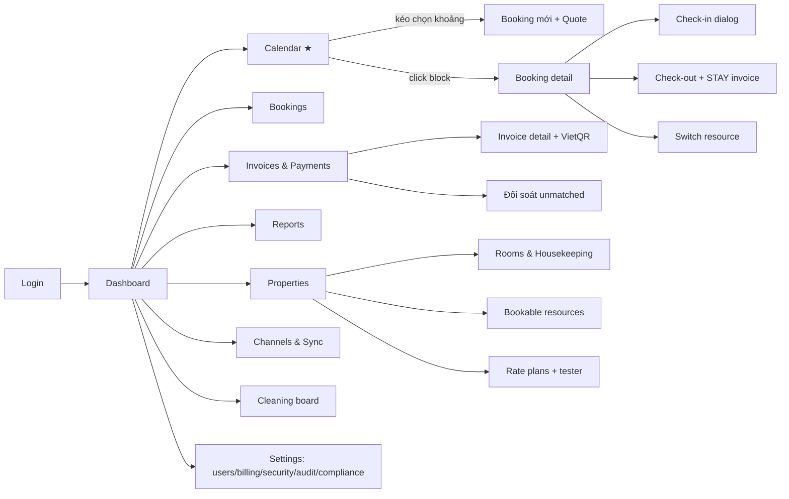

# UI/00 — TỔNG QUAN UI & DESIGN SYSTEM

> **Phiên bản 1.0 (2026-06-10).** Bộ UI spec gồm 4 file: file này (nguyên tắc + sitemap + đếm page) · [`01-web-admin-pages.md`](01-web-admin-pages.md) (35 page admin) · [`02-web-staff-pages.md`](02-web-staff-pages.md) (9 page PWA nhân viên) · [`03-key-flows.md`](03-key-flows.md) (8 flow nghiệp vụ xuyên màn hình). 4 file **phân tầng, không trùng lặp**: 00 = nguyên tắc/token/sitemap tổng → 01·02 = inventory từng page (admin/staff) → 03 = flow nối nhiều page (tham chiếu mã màn hình ở 01/02). FE build theo đây — không tự chế route/luồng.

## 1. Tổng số page (đếm theo route, không tính dialog/drawer)

| App | Số page | Ghi chú |
|-----|--------:|---------|
| `web-admin` | **35** | 4 auth · 1 dashboard · 1 calendar · 3 bookings · 2 guests · 4 finance · 7 properties/pricing · 3 reports · 2 channels · 1 cleaning · 1 notifications · 6 settings |
| `web-staff` (PWA) | **9** | 1 auth · 8 nghiệp vụ |
| **Tổng MVP** | **44** | `web-guest` = phase 2, không nằm trong đếm này |

Dialog/drawer (check-in, record payment, switch resource…) được liệt kê **bên trong** page chứa nó ở file 01/02 — chúng là component, không phải route.

## 2. Nguyên tắc thiết kế

1. **Desktop-first cho admin** (lễ tân/chủ dùng laptop ≥1280px là chính; vẫn responsive xuống 768px). **Mobile-first cho staff PWA** (360–430px, dùng 1 tay, găng tay dọn phòng → nút to ≥44px).
2. **Calendar là màn hình trung tâm** của admin — mọi đường đều dẫn về calendar; thao tác thường nhật (tạo booking, đổi phòng, xem trạng thái) làm được ngay trên calendar không cần rời trang.
3. **Realtime mặc định:** mọi màn hình hiển thị dữ liệu sống (calendar, today, invoice đang chờ QR) đều subscribe SSE → invalidate query (`10` §4). Không thiết kế nút "Refresh" làm cơ chế chính.
4. **Tiếng Việt mặc định**, i18n key sẵn `en`. Tiền `1.500.000 ₫` (`Intl 'vi-VN'`); ngày `dd/MM/yyyy`, giờ 24h; mọi giờ hiển thị theo **timezone property**.
5. **Quyền quyết định UI:** menu/nút render theo permission matrix (`04` §4) — nhưng đây chỉ là UX; server vẫn là người quyết (403 phải được xử lý đẹp dù nút đã ẩn).
6. **Không trang nào được phép thiếu 4 trạng thái:** loading (skeleton), empty (hướng dẫn hành động đầu tiên), error (retry + request_id), partial (dữ liệu cũ + banner reconnecting khi SSE đứt).

## 3. Design tokens — kiến trúc 2 TẦNG (nguồn sự thật: `packages/ui/src/styles.css`)

Phong cách: **Modern Hospitality** (teal dẫn dắt, nền warm-neutral, surface phân tầng + shadow mềm). Token chia **2 tầng** để đổi theme luôn ổn định:

- **Tầng 1 — Primitive** (`--p-*`, OKLCH): bảng màu gốc (teal 50–950, neutral ấm, accent, sand). Nơi DUY NHẤT chứa màu thô. **KHÔNG** map vào `@theme` → không có utility `bg-p-teal-50` → cấm gọi màu thô trong JSX.
- **Tầng 2 — Semantic**: trỏ vào tầng 1, là thứ duy nhất vào `@theme inline`. Component/trang **chỉ** dùng các utility này.

| Nhóm semantic | Token (utility) | Ghi chú |
|---|---|---|
| Nền/surface | `background`, `surface`, `surface-muted`, `card`, `popover` | 3 mức nền + elevation |
| Brand | `primary` (teal-600 `#0d9488`), `primary-foreground/-hover/-muted` | CTA, link, active |
| Text | `foreground`, `muted-foreground`, `subtle-foreground` | |
| Trạng thái | `success`/`warning`/`destructive`(rose)/`info` + `-foreground`/`-muted` | |
| Đường nét | `border`, `border-strong`, `input`, `ring` | |
| Chip tonal | `chip-{brand,blue,violet,amber,emerald}` + `-soft` | StatCard / icon chip |
| Booking | `booking-{hold,pending,confirmed,checkedin,ota}`, `block` | amber-400/orange-500/teal-600/blue-600/violet-500 |
| Housekeeping | `hk-{clean,dirty,cleaning,inspection}` | green/red/amber/sky-500 |
| Elevation | `shadow-{xs,sm,md,lg}` | shadow mềm, token hoá theo theme |
| Radius / Font | `rounded-{sm…2xl}` (base `--radius` .75rem) · Inter (latin+vietnamese) | |

**Theme:** đặt `data-theme` trên `<html>` — `light` (mặc định, Modern Hospitality) · `dark` · `warm` (Warm Boutique). Mỗi theme là một block `[data-theme="x"]` chỉ trỏ lại tầng 2; **đổi theme không đụng component**. No-flash script `themeInitScript` (export từ `@pms/ui`) nhúng đầu `<body>`; runtime đổi qua `document.documentElement.dataset.theme`. ThemeSwitcher UI ở Settings để task 6.7.

**Quy tắc bất biến:** component/trang **không dùng màu thô** (`bg-teal-50`, `text-amber-700`, `from-teal-700`…) — chỉ token semantic ở trên. Màu trạng thái booking/housekeeping là **ngôn ngữ chung** mọi màn hình và **cố ý bất biến theo theme** (màu mang nghĩa).

## 4. Component nền (từ `@pms/ui` — app KHÔNG copy shadcn riêng)

Bộ shadcn chuẩn (Button, Dialog, Sheet, Table, Form, Select, Popover, Toast, Tabs, Badge, Skeleton…) cộng **component nghiệp vụ dùng chung**:

| Component | Mô tả |
|-----------|-------|
| `MoneyInput` / `MoneyText` | Nhập/hiện VND (dấu chấm ngàn, không số lẻ) |
| `DateRangePicker` / `DateTimePicker` | Theo TZ property, tuần bắt đầu T2, ngày lễ highlight |
| `StatusBadge` | booking/invoice/payment/cleaning status → màu token §3 |
| `GuestPicker` | Search (tên/SĐT/4 số cuối giấy tờ) + tạo nhanh inline |
| `ResourcePicker` | Chọn resource (group theo property, phân biệt ROOM/WHOLE) |
| `QuoteBreakdown` | Bảng line_items + tổng + cọc phải trả |
| `VietQrPanel` | QR + số tiền + nội dung CK + trạng thái realtime (chờ → tick xanh khi `payment.received`) |
| `ConfirmDangerDialog` | Mọi hành động không đảo ngược (void, refund, hard delete) — gõ lý do bắt buộc |
| `AuditDrawer` | Xem lịch sử thay đổi entity (từ audit_logs) |
| `OfflineBanner` | PWA: hiện khi mất mạng, disable mutation |

### 4.5. Bộ thư viện UI đã chốt (quyết định — agent build KHÔNG tự chọn lib khác)

| Bài toán | Thư viện | Ghi chú |
|----------|----------|---------|
| Bảng dữ liệu | **TanStack Table v8** (headless) | Theo shadcn DataTable pattern; sort/filter server-side |
| **Calendar timeline (C1)** | **TỰ DỰNG**: CSS Grid + **TanStack Virtual** (virtualize hàng phòng) + **dnd-kit** (kéo-thả) | KHÔNG dùng FullCalendar resource-timeline/Bryntum: license Premium (~$480+/năm) mà vẫn phải custom nặng cho hourly mode, buffer mờ 2 đầu, WHOLE-booking span nhiều phòng. Grid phòng×ngày là bài toán bounded — tự dựng kiểm soát 100% |
| Drag & drop | **dnd-kit** | Calendar (đổi resource/ngày) + Kanban cleaning |
| Charts | **Recharts** (P&L, break-even) | Heatmap occupancy **tự render** bằng grid + thang màu — không cần chart lib |
| Icons / Toast | **lucide-react** / **sonner** | Mặc định hệ sinh thái shadcn |
| Command palette | cmdk | Phase 2 |
| Pattern bắt buộc | Data-hook (TanStack Query) **tách khỏi** component hiển thị | Component nhận props thuần → test/Storybook được, tái dùng admin↔staff |

> **Nguồn sự thật thiết kế duy nhất là `docs/ui/`.** KHÔNG dùng tool sinh mockup ngoài (Google Stitch, v0, Figma-AI...) trong quá trình build — output của chúng không map vào kiến trúc shadcn/Next và tạo nguồn sự thật thứ hai gây drift. Cần xem trước look & feel → dựng prototype bằng chính component của `packages/ui`.

## 5. Navigation & menu theo role (web-admin)

| Menu | OWNER | MANAGER | ACCOUNTANT | STAFF |
|------|:-----:|:-------:|:----------:|:-----:|
| Dashboard | ✓ | ✓ | ✓ | ✓ |
| Calendar | ✓ | ✓ | — | ✓ |
| Bookings | ✓ | ✓ | ✓ (read) | ✓ |
| Guests | ✓ | ✓ | — | ✓ |
| Invoices / Payments | ✓ | ✓ | ✓ | ✓ (record only) |
| Đối soát (unmatched) | ✓ | — | ✓ | — |
| Properties (cấu hình) | ✓ | ✓ (property mình) | — | — |
| Reports | ✓ | ✓ | ✓ | — (chỉ operational) |
| Channels | ✓ | ✓ | — | — |
| Cleaning | ✓ | ✓ | — | ✓ |
| Settings: Users/Billing | ✓ | — | — | — |
| Settings: Audit | ✓ | — | ✓ | — |

(HOUSEKEEPER không dùng web-admin — chỉ dùng web-staff PWA.)

## 6. Quy ước xử lý lỗi API trên UI (map từ `05`)

| Lỗi | UX bắt buộc |
|-----|-------------|
| `401` | Silent refresh → retry 1 lần → còn lỗi: về /login (giữ returnUrl) |
| `403 AUTHZ_*` | Toast "Bạn không có quyền…" — KHÔNG redirect |
| `409 BOOKING_OVERLAP` | Dialog hiện conflict (booking nào, khoảng nào) + nút "Xem trên calendar" |
| `409 PRICE_CHANGED` | Panel so sánh giá cũ → giá mới, khách bấm "Đồng ý giá mới" → re-quote + retry |
| `409 VERSION_CONFLICT` | Banner "Dữ liệu đã được người khác sửa" + nút reload form (giữ input đang gõ nếu được) |
| `422 PLAN_LIMIT_REACHED` | Dialog nâng gói (CTA → Settings/Billing) |
| `423` | Toast "Đang được giữ chỗ/xử lý, thử lại sau" |
| `429` | Toast + tự retry với backoff, disable nút |
| `5xx` | Toast lỗi hệ thống kèm `request_id` (copy được) |

## 7. Sitemap tổng (web-admin)

## 8. Hiệu năng & chất lượng UI

- Bundle: route-based code splitting (Next mặc định); calendar virtualize hàng (50 phòng × 30 ngày không lag); ảnh qua `next/image` + R2.
- TTI trang calendar < 2.5s trên 4G; PWA staff: precache shell, mở lại < 1s.
- Accessibility baseline: focus ring, label đầy đủ, contrast AA, thao tác bàn phím cho dialog/form.
- Form: validate Zod (shared-types) ngay khi blur; submit disable + spinner; không double-submit (idempotency key sinh per lần mở form).
